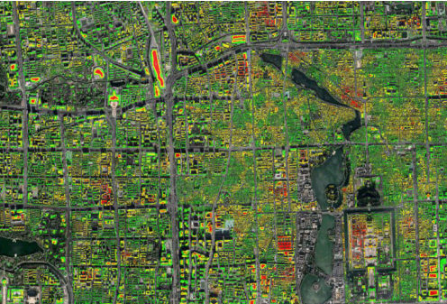
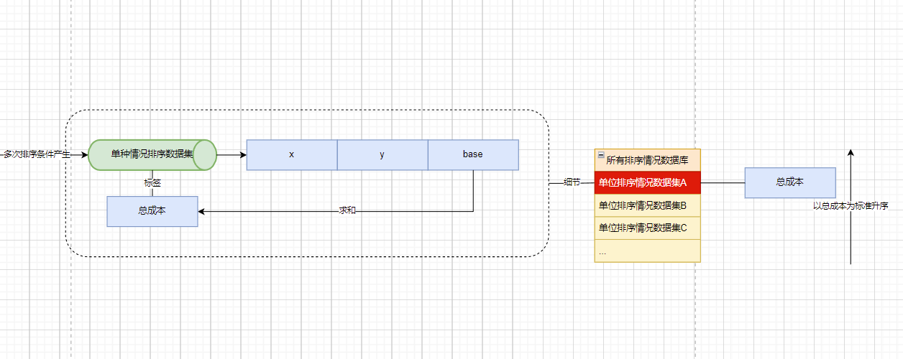
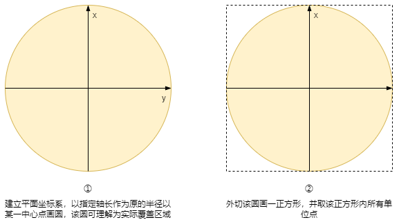

# 2022MotherCup-D - 移动通信网络站址规划和区域聚类问题


> **仅供交流学习，未经授权禁止转载！**

##### 简体中文

移动通信技术规模飞速发展，运营规模也越来越大，导致带来的通信网络越来越复杂。随着 5G 的发展，通信的带宽越来越大，但基站的能覆盖范围越来越小，使得覆盖同样的区域，需要的基站数量变的更多。另外，基站和天线的种类也变多了。这就使得通信网络的规划特别是站址选择的问题变得越来越复杂。**站址选择问题是：根据现网天线的覆盖情况，给出现网的弱覆盖区域，选择一定数量的点，使得在这些点上新建基站后，可以解决现网的弱覆盖区域的覆盖问题。例如，下图为某城市某区域的现网覆盖情况，其中红色的区域表示为弱覆盖区域。**



在实际网络规划中，考虑基站的建设成本和一些其他因素，有时候可能无法把所有弱覆盖区域都解决，这时候就需要考虑业务量的因素，尽量优先解决业务量高的弱覆盖区域。 

为了便于计算，将给定的区域用很小的栅格进行划分，只考虑每个栅格的中心点，即任给一个区域，都可以划分成有限个点。每个点有一些属性值，包括：坐标，是否为弱覆盖点，业务量等。站址也只能选择区域内 2 的点。某个点是否被规划基站覆盖可以按如下方法判断： 

设选择基站的覆盖范围为 d，基站所规划的点的坐标为： $P_{0}(x_{0},y_{0})$  ，则对于坐标为 $P(x,y)$ 的点，若 $|P- P_{0}|_{2}≤d$ ，则认为该点被该基站覆盖，否则认为该点没有被该基站覆盖。

同时，实际中还需要考虑一个约束条件，即新建站址之间以及新建站址和现有站址之间的距离不能**小于等于给定门限**。


## 📌问题

给定区域的大小是 2500×2500 个栅格即 2500×2500 个点， 其中横坐标范围是 0 到 2499，纵坐标范围是 0 到 2499 。[附件1](TopicData/附件1 弱覆盖栅格数据(筛选).csv)是筛选出该区域中的弱覆盖点的信息，包括每个点的坐标和业务量。

给定 2 种基站：

| 类型   | 覆盖范围 | 成本 |
| ------ | -------- | ---- |
| 宏基站 | 30       | 10   |
| 微基站 | 10       | 1    |

[附件2](TopicData/附件2 现网站址坐标(筛选).csv)中还给出了现网基站的坐标点，新建站址之以及新建站址和现有站址之间的距离的门限是 10 。

根据给定的信息和附件中的数据，进行站址规划，使得弱覆盖点总业务量的 90% 被规划基站覆盖。给出选择的站址的坐标以及每个站址选择的基站种类。站址的坐标只能在给定区域内的 2500×2500 个点中选择。


## 🚩模型建立

1. **设计三个可能要用到的数据集及其对象和对象属性**

   | 数据集             | 对象属性             |
   | ------------------ | -------------------- |
   | 题目环境全部坐标集 | x(0-2499), y(0-2499) |
   | 不能建站的坐标集   | x, y                 |
   | 可以建站的坐标集   | x, y, traffic        |

   > 对象及对象属性：每个数据单位为对象，对象的数据结构称为属性
   >
   > traffic：业务量
   >
   > x, y：X轴坐标、Y轴坐标

2. **从原生数据提取关键信息**

   分析原生数据集其对象和对象属性：

   | 数据集文件                                        | 数据集命名（人工简称） | 对象属性      |
   | ------------------------------------------------- | ---------------------- | ------------- |
   | [附件1](TopicData/附件1 弱覆盖栅格数据(筛选).csv) | 弱覆盖                 | x, y ,traffic |
   | [附件2](TopicData/附件2 现网站址坐标(筛选).csv)   | 现有基站               | id, x, y      |

   分析得知其中 **id** 应该是基站序列号，与后面模型交互意义不大，可忽略。

   > 原生数据：官方题目附件给出的数据集

3. **基于原生数据集形成步骤1中设计的数据集**

   

   ①根据题目环境全部坐标集对象属性的取值范围区间穷举得到题目环境全部坐标集。

   ②现有基站经过门限这一条件与相关“取点算法”的筛选得到不能建站的数据集，门限为常量10。（“取点算法”在模型求解中有具体介绍）。

   ③在题目环境全部坐标集过滤掉不能建站的坐标集中的坐标即可得到可以建站的坐标集。

   ④在可以建站的坐标集中弱覆盖的坐标应赋予对应业务量属性，业务量属性可从弱覆盖中提取。

   ⑤以业务量为标准，将可以建站的坐标集的对象进行降序排序形成接下来排序任务的后期排序任务原始坐标集。

4. **穷举满足题目条件各种情况的选址基站坐标集**

   题目条件：弱覆盖点总业务量90%被规划基站覆盖。

   

5. **从所有情况中择出最优方案**

   每个满足条件的选址基站坐标集都有该方案总成本的标签属性，以该标签属性为标准升序排序选出总成本最低的那个即为最优方案。

   

6. **总架构图展示**

   


## 🧮模型求解

1. **基本介绍**

   结合程序来解释模型求解的过程，所有程序在同一工作目录的顶级文件夹。接下来的内容主要解析程序之间的逻辑关系和算法思路，程序完整运行结构请见于提交的程序附件压缩包。

   (1) **工作目录结构介绍**

   ```
   2022MotherCup-D/
   ├── main.py
   ├── DataOperate.py
   ├── ConditionJudge.py
   ├── Convert.py
   ├── TopicData
   ├── venv(Python虚拟环境及本题目程序调用库)
   └── Data
   	└── StationData
           ├── highCost
           ├── lowCost
           ├── highInsertLow
           ├── lowInsertHigh
           ├── FeaturedPlan
           └── highCost
   ```

   (2) **不同程序作用介绍**

   程序文件是收录同类操作函数的合集，并不代表数学流程，其中的操作函数才执行数学建模解题流程。

   | 程序文件          | 作用                                                       |
   | ----------------- | ---------------------------------------------------------- |
   | main.py           | 数学解题过程的直接操作，同时也是整个题目模型求解的程序入口 |
   | DataOperate.py    | 收录根据特定情况生成所需数据集以及数据集相关操作           |
   | ConditionJudge.py | 收录所有要用到的条件判断操作                               |
   | Convert.py        | 数据集文件与程序可操作数据集互相转换                       |

   (3) **数据集生成与储存**

   | 文件夹      | 收录                                                         |
   | ----------- | ------------------------------------------------------------ |
   | TopicData   | 官方题目给出的原生数据                                       |
   | Data        | 程序生成的数据集存放处                                       |
   | StationData | 满足题目业务量条件所有可建站选址的坐标集数据库，里面还存放着不同大方案的子数据集库 |

   (4) 不同大方案的数据集库

   | 文件夹        | 收录                                                         |
   | ------------- | ------------------------------------------------------------ |
   | highCost      | 大方案一：每个基站皆为宏基站的且满足题目条件的坐标集（所有情况） |
   | lowCost       | 大方案二：每个基站皆为微基站的且满足题目条件的坐标集（所有情况） |
   | highInsertLow | 大方案三：基于大方案一产生的坐标集从原本全部基站为宏基站逐步替换或插入微基站且满足题目条件的坐标集（所有情况） |
   | lowInsertHigh | 大方案四：基于大方案二产生的坐标集从原本全部基站为微基站逐步替换或插入宏基站且满足题目条件的坐标集（所有情况） |
   | FeaturedPlan  | 大方案精选：四个大方案中成本最低的建站选址坐标集             |
   | bestPlan      | 从大方案精选中继续排序选出成本最低的建站选址坐标集，即为该题答案 |

2. **数学主干解算流程**

   在`mian.py`程序中，以下流程索引函数代表程序操作的数学解算主干步骤。 

   ```python
   if __name__ == '__main__':
       Op_TotalBanCoordinate()
       Op_TotalCoordinate()
       Op_AbleCoordinate()
       Op_MeetConditionCoordinate()
       Op_SortLeastCost()
   ```

   | 流程索引函数                 | 数学解算主干步骤                                             |
   | ---------------------------- | ------------------------------------------------------------ |
   | Op_TotalBanCoordinate()      | 基于原生数据《附件2 现网站址坐标(筛选).csv》生成不能建站的坐标集并输出为CSV数据集文件《不能建站的坐标集.csv》 |
   | Op_TotalCoordinate()         | 生成题目环境全部坐标集并输出为CSV数据集文件《题目环境全部坐标集.csv》 |
   | Op_AbleCoordinate()          | 生成可以建站的坐标集并输出为CSV数据集文件《可以建站的坐标集.csv》 |
   | Op_MeetConditionCoordinate() | 生成满足题目条件的建站选址坐标集并输出为CSV数据集文件，也就是`StationData`下各大方案的数据集 |
   | Op_SortLeastCost()           | 从每个大方案的逐个子方案排序选出最低成本的建站选址坐标集，然后再在不同大方案最低成本中排序选出最优方案即为该题答案 |

3. **计算机底层数据处理辅助函数**

   收录于`Convert.py`程序中。

4. **条件判断操作**

   收录于`ConditionJudge.py`程序中。

   (1) **BanCoordinate(positionX,positionY)**：基于门限这一限定条件，输入某坐标，输出不能建站的坐标集。

   (2) **CoverCoordinate(positionX,positionY,coverRadius)**：基于覆盖范围限定条件，输入某坐标，输出已覆盖的坐标集。

   (3) **前两者函数算法解析**

   

   依次算出正方形内取的每个点与中心点的距离，再把距离进行与限定条件判断，满足限定条件即为覆盖点

   距离公式：设需判断点为 $P(x_{0},y_{0})$ ，中心点为 $P_{c}(x,y)$ ， $|P-P_{c}|_{2}=d$ 。

5. **数据集生成与处理**

   (1) **TotalBanCoordinate(existingStationList)**：生成不能建站的坐标集。

   (2) **TotalCoordinate(positionRange=([0,0],[2499,2499]))**：生成题目环境全部坐标集，默认参数生成该题建模的 2500×2500 二维平面栅格坐标。

   (3) **FilterCoordinate(totalPosition,unincludePosition)**：生成按条件过滤不包含规定坐标集的坐标集。

   

   (4) **GetTraffic(coordinate,weakCoverCoordinate)**：给坐标集赋予业务量属性。


   (5) **AbleCoordinate(totalCanPosition,weakCoverCoordinate)**: 给可以建站的每个坐标对象赋予业务量属性。

   (6) **满足条件的建站选址筛选**
   满足条件即满足弱覆盖点总业务量90%被规划基站覆盖，判断建站选址筛选满足条件的前提是选出一定量的点。总共有四种算法，每种算法基于一个基本算法。
   ①基本算法：何时开始何时结束以及一个操作流程循环。

   

   ②基本算法：如何取得所有情况。

   

   ③四种算法：

​      a. 取所有情况时，所有点的基站种类皆为宏基站。

​      b. 取所有情况时，所有点的基站种类皆为微基站。

​      c. 基于a算法生成的数据集库，对每个数据集再次进行算法调整生成c算法数据集：降序依次将宏基站替换为微基站，每次替换时如果业务量大于满足条件，则在a算法生成的数据集末尾宏基站后增添一个微基站。

​      d. 基于b算法生成的数据集库，对每个数据集再次进行算法调整生成d算法数据集：降序依次将微基站替换为宏基站，每次替换时如果业务量大于满足条件，则将b算法生成的数据集末尾微基站删除。

  > 所有的增添顺序优先级基于排序任务后的原始可建站坐标集具体算法实现见最后面几个前面和后面均未在论文介绍的程序函数

   (7) **最低成本最优方案筛选**

   将储存对应子方案数据集的文件命名格式为`ID%id%-COST-%cost%.csv`。

> %id%：对应子方案的索引，保证数据集唯一性，即防止可能出现的总成本一致但选址基站坐标集不一致，仅仅用成本命名会出现数据集文件覆盖
>
> %cost%：对应子方案的总成本

   **CostSort(DataGatherPath)**：根据文件名选出成本最低的建站选址数据集。


## 🔎模型评价

基于该模型设计架构开发的程序在算法处理上是穷举出全部符合条件的情况，这意味着数据量之巨大，可以将数据按照生成条件分段生成，在计算机底层上可以多线程并行工作同时生成数据，最后将每个线程生成的数据合并。

例如：在生成题目环境全部坐标集时，即生成 2500x2500 二维平面栅格的坐标集，有 625 万条数据，那么可以分成 (0-250,0-250) ,  (251-500，251-500) ……多段条件同时交给不同线程处理。设置足够多的线程数提载计算机的性能占用提高数据的生成效率。

以下为计算机多线程规划任务函数：

```python
def MultithreadingWork(FunctionWork,conditionMin,conditionMax,threadAmount): #计算机底层多线程规划任务，让数据集生成更快
    if(len(conditionMax) != len(conditionMin)):#检查生成条件极值的对称性
        return False
    else:
        parameterLen = len(conditionMin)
        conditionStep = [] #根据线程数将生成条件分段
        parameterID = 0
        while(parameterID < parameterLen):
            conditionStep.append(int((conditionMax[parameterID] - conditionMin[parameterID])/threadAmount)) #将数据集生成条件依据线程数进行分段，平均每段的生成条件区间长度
            parameterID += 1
        conditionData = [] #将数据集分段出多个子数据集的数据集
        conditionParameter = [] #单位生成条件集
        #数据集生成条件平均分段给不同线程进行同时工作运算生成数据集
        threadIndex = 1 #线程索引
        while(threadIndex <= threadAmount):
            if(threadIndex == 1):
                parameterID = 0
                conditionParameter_ini0 = []
                conditionParameter_ini1 = []
                while (parameterID < parameterLen):
                    conditionParameter_ini0.append(conditionMin[parameterID])
                    conditionParameter_ini1.append(conditionMin[parameterID] + conditionStep[parameterID])
                    parameterID += 1
                conditionParameter.append(conditionParameter_ini0)
                conditionParameter.append(conditionParameter_ini1)
            elif(threadIndex < threadAmount and threadIndex != 1):
                parameterID = 0
                while(parameterID < parameterLen):
                    conditionParameter[0][parameterID] = int(conditionParameter[0][parameterID]) + conditionStep[parameterID]
                    conditionParameter[1][parameterID] = int(conditionParameter[0][parameterID]) + conditionStep[parameterID]
                    parameterID += 1
            elif(threadIndex == threadAmount):
                parameterID = 0
                while (parameterID < parameterLen):
                    conditionParameter[0][parameterID] = int(conditionParameter[0][parameterID]) + conditionStep[parameterID]
                    conditionParameter[1][parameterID] = conditionMax[parameterID]
                    parameterID += 1
            conditionData.append(conditionParameter)
            exec("threadWork{} = Thread_canReturn(target=FunctionWork,args=(conditionData[{}][0],conditionData[{}][1]))".format(threadIndex,threadIndex - 1,threadIndex - 1))
            exec("threadWork{}.start()".format(threadIndex))
            print("线程" + str(threadIndex) + "已开始工作")
            threadIndex += 1
        # 等待全部线程工作完毕
        threadIndex = threadAmount #线程索引
        while(threadIndex > 0):
            exec("threadWork{}.join()".format(threadIndex))
            print("线程" + str(threadIndex) + "已结束工作")
            threadIndex -= 1
        *
        #轮询等待全部线程工作完毕
        threadIndex = 1  # 线程索引
        threadStatus_total = 0 #线程工作状态
        while(threadStatus_total < threadAmount):
            if(threadIndex > threadAmount):
                threadIndex = 1
            exec("threadStatus = threadWork{}.is_alive()".format(threadIndex))
            print("线程" + str(threadIndex) + "工作状态：" + str(threadStatus))
            if(threadStatus == False):
                threadStatus_total += 1
                print("线程" + str(threadIndex) + "已结束工作")
            threadIndex += 1
        *
        #获取线程输出结果并对结果进行处理
        threadIndex = 1
        threadResult_total = [] #线程工作输出结果集
        while(threadIndex <= threadAmount):
            exec("threadResult = threadWork{}.get_result()".format(threadIndex))
            threadResult_total.append(threadResult)
            threadIndex += 1
        threadIndex = 1  # 线程索引
        threadResultTotal = [] #线程工作输出结果合并集
        for threadResultEach in threadResult_total:
            threadResultTotal += threadResultEach
            print("正在合并线程" + str(threadIndex) + "输出结果")
            threadIndex += 1
        print("所有线程输出结果合并完成！")
        return threadResultTotal
```

由于Python多线程Threading库没有返回线程工作函数返回值的方法，所以单有以上函数只能实现“子线程计算生成数据集但不能向主程序返回数据集“，需要继承`Threading.Thread`类构造返回工作函数返回值的方法：

```python
class Thread_canReturn(threading.Thread): #继承threading.Thread类增添方法使得能获取多线程工作函数返回的值
    def __init__(self,target,args):
        threading.Thread.__init__(self)
        self.Target = target
        self.Args = args
    def run(self):
        self.result = self.Target(self.Args)
    def get_result(self):
        return self.result
```

由于时间关系以上方法构造完后在Debug时仍出现问题，所以此优化方案在本次比赛中就搁置了。仍可在程序附件中找到对应代码段和第一次尝试使用此方案于实际数据生成工作任务的位置。
